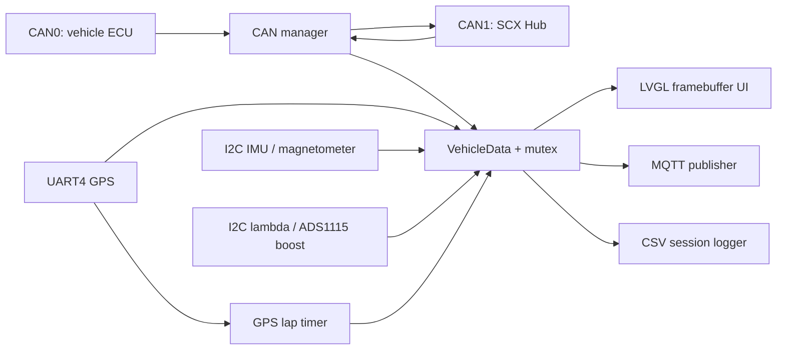

# Isuzu MFD Dashboard — Project Documentation

## 1. Overview

`isuzu_mfd` is an embedded C99 dashboard application for an Isuzu D-Max racing/telemetry installation. It runs on Linux with an LVGL framebuffer user interface and combines:

- CAN0 vehicle telemetry and OBD polling
- CAN1 communication with an SCX Hub keypad/display controller
- GPS position, time, and speed from a u-blox M9N/N9M receiver
- IMU, magnetometer, boost-pressure, and lambda I2C sensors
- MQTT telemetry publishing
- Per-session CSV telemetry logging
- GPS-polygon lap timing

The application is built with CMake and deployed as a systemd service.

## 2. Repository layout

| Path | Purpose |
| --- | --- |
| `app/main.c` | Application startup, worker threads, GPS integration, MQTT thread, and main LVGL loop. |
| `app/config_parser.*` | Parses runtime configuration from `/mnt/candata/config.txt`. |
| `app/mqtt_client.*` | Connects to the broker and publishes JSON telemetry. |
| `app/csv_logger.*` | Creates and appends CSV telemetry session files. |
| `app/lap_timer.*` | Detects configured GPS start/finish polygons and measures laps. |
| `app/gps_m9n.*` | UART NMEA parser for GPS position, UTC time, speed, and satellites. |
| `app/ads1115_pressure.*` | ADS1115 boost/MAP pressure input. |
| `app/lambda_i2c.*` | Lambda sensor I2C input. |
| `app/ism330_imu.*` | ISM330DHCXTR accelerometer/gyroscope input. |
| `app/mmc5983ma_mag.*` | MMC5983MA magnetometer input. |
| `can/can_mgr.*` | SocketCAN CAN0 vehicle handling and CAN1 SCX Hub integration. |
| `decode/signals.*` | Shared `VehicleData` state protected by `data_mutex`. |
| `ui/ui.*` | LVGL dashboard pages, widgets, and queued SCX navigation. |
| `ui/styles.*` | UI style setup. |
| `scripts/` | Hardware and CAN diagnostic/helper scripts, including SCX test tooling. |
| `MQTT_TELEMETRY.md` | Backend-facing MQTT wire contract. |
| `isuzu_mfd.service` | Reference systemd unit file. |
| `build/` | CMake build output; not source code. |

Third-party LVGL and LVGL driver sources are held in `lvgl/` and `lv_drivers/`.

## 3. Architecture



`VehicleData` is the shared state. Sensor, GPS, and CAN workers update it under `data_mutex`; the UI and MQTT threads take a protected local copy before consuming it.

### Main workers

| Worker | Approximate rate | Responsibility |
| --- | --- | --- |
| `can_rx` | event driven | Receives vehicle CAN frames and updates decoded values. |
| `can_tx` | periodic | Sends OBD requests on CAN0. |
| `scx_can` | 5 ms loop | Receives SCX button state and sends engine RPM to SCX. |
| `gps_m9n` | 5 Hz | Parses GPS UART data and executes lap timing. |
| `ism330_imu` | 50 Hz | Updates acceleration, gyro, and IMU temperature. |
| `mmc5983ma` | 50 Hz | Updates magnetometer values. |
| `ads1115` | 20 Hz | Updates boost pressure. |
| `lambda` | 10 Hz | Updates lambda value. |
| `mqtt_pub` | 25 Hz maximum | Publishes JSON and appends a matching CSV record after a successful publish. |
| UI main loop | about 60 FPS | Runs LVGL and handles queued navigation actions. |

## 4. Hardware interfaces

| Interface | Device / protocol | Use |
| --- | --- | --- |
| CAN0 | SocketCAN, 500 kbit/s | Isuzu ECU telemetry and OBD requests. |
| CAN1 | SocketCAN, 500 kbit/s, sample point 62.5% | SCX Hub button input and RPM output. |
| UART4 | `/dev/ttyS4`, 38400 baud | u-blox M9N/N9M GPS NMEA receiver. |
| I2C | ADS1115 | Physical boost/MAP pressure. |
| I2C | Lambda controller | Lambda ratio. |
| I2C | ISM330DHCXTR | Acceleration and gyroscope. |
| I2C | MMC5983MA | Magnetometer. |
| Framebuffer | LVGL + `fbdev` | 800 × 480 dashboard display. |

CAN interfaces must be electrically correct: common ground, correct CAN-H/CAN-L polarity, active SCX Hub power, and suitable bus termination. A CAN interface can appear `UP` in Linux but still be unable to communicate if it is `ERROR-PASSIVE` or the remote device is not powered.

## 5. User interface

There are three dashboard pages:

1. **Engine:** RPM, lambda, boost, vehicle speed, fuel rail pressure, and coolant temperature.
2. **Temperatures/GPS:** coolant, intake air, oil temperature, rail pressure, injection duty, and satellite sky plot.
3. **Racing/GPS:** GPS speed and top speed, boost and maximum boost, GPS local display time, lateral/longitudinal G-force, and lap time.

### SCX navigation

The SCX Hub sends function state via CAN ID `0x121`. New pressed bits are converted into UI navigation requests on the CAN worker; the UI worker then changes pages safely.

| SCX function | Action |
| --- | --- |
| F1 | Previous page / up |
| F2 | Previous page / left |
| F3 | Next page / down |
| F4 | Next page / right |
| F5 | Next page / enter |

The app receives only new button presses, so a held button does not repeatedly advance pages.

## 6. SCX CAN1 protocol

| Direction | CAN ID | Format |
| --- | --- | --- |
| SCX Hub → dashboard | `0x121` | 8-byte function state bitmap. Functions F1–F30 use bits 0–29 in bytes 1–4. |
| Dashboard → SCX Hub | `0x212` | 8-byte RPM report, big-endian RPM in bytes 6–7. |

RPM is transmitted approximately every 40 ms. CAN1 is configured to 500 kbit/s with a 62.5% sample point.

For manual diagnosis, capture SCX button frames with a filter for `0x121` and confirm the expected bits change when buttons are pressed.

## 7. Runtime configuration

The runtime file is:

```text
/mnt/candata/config.txt
```

Every setting uses the exact format `#KEY:VALUE`, without spaces around the colon.

```text
#SERVER:broker.example.com
#PORT:1883
#MQTT_USER:dashboard_device
#MQTT_PASSWORD:replace-with-a-secret
#APN:internet
#CAR-NUMBER:OMR-01
#DEVICE:6
#EVENT:pt
#CLASS:isuzu
#START:13.765500,100.581500;13.765360,100.581555;13.765300,100.581350;13.765440,100.581295
#FINISH:13.765956,100.582751;13.765715,100.582835;13.765655,100.582600;13.765855,100.582483
#LAP_MIN_SECONDS:10
```

### Supported settings

| Key | Required | Description |
| --- | --- | --- |
| `SERVER` | Yes for MQTT | MQTT hostname or IPv4 address. |
| `PORT` | No | MQTT TCP port; default `1883`. |
| `MQTT_USER` | No | Broker username. |
| `MQTT_PASSWORD` | No | Broker password. Never commit a production secret. |
| `APN` | No | Cellular APN retained for system configuration. |
| `CAR-NUMBER` | No | Vehicle identifier sent in telemetry. |
| `DEVICE` | No | Numeric device ID; default `1`. Used in the MQTT client ID and topic. |
| `START` | No | Four `lat,lon` corners separated by semicolons for the start zone. |
| `FINISH` | No | Four `lat,lon` corners separated by semicolons for the finish zone. |
| `LAP_MIN_SECONDS` | No | Minimum valid elapsed time before a finish crossing is accepted; default `10`. |

`EVENT` and `CLASS` are accepted as deployment metadata but current MQTT values are fixed by the source code.

## 8. GPS and lap timing

The GPS worker only applies polygon timing when `fix_valid` is true.

1. The initial valid GPS position establishes whether the car is already in either zone and does not trigger timing.
2. Entering the `START` polygon begins the timer.
3. Entering the `FINISH` polygon ends the timer if elapsed time is at least `LAP_MIN_SECONDS`.
4. The most recently completed time remains on Page 3 until a new start crossing.

The timer uses `CLOCK_MONOTONIC`, so elapsed lap timing is unaffected by UTC sync or local timezone changes.

GPS position updates occur at 5 Hz, so start and finish zones should be broad enough to account for receiver precision and vehicle speed. Normally use a corridor roughly 10–20 meters wide and ensure the four corners are ordered around the polygon perimeter.

## 9. MQTT telemetry

MQTT details and the full JSON schema are documented in `MQTT_TELEMETRY.md`.

Current transport behavior:

| Setting | Value |
| --- | --- |
| Broker | `tcp://<SERVER>:<PORT>` |
| Client ID | `isuzu_device_<DEVICE>` |
| Topic | `/isuzu/omr/<DEVICE>` |
| QoS | `0` (at most once) |
| Retained | `false` |
| Maximum rate | 25 Hz (40 ms) |
| Timestamp | `datetime` is always UTC in `DD/MM/YY HH:MM:SS` form. |

The current code is in **testing mode**: it publishes whenever MQTT is connected, including when RPM is zero. Restore the RPM condition in `mqtt_thread()` before production operation if engine-only reporting is required.

## 10. CSV logging

Each application start creates one file in:

```text
/mnt/candata/data/YYMMDD_HH:MM:SS.csv
```

The filename uses the device local time (currently UTC+7). Each CSV row uses the same `datetime` logic as MQTT and is always UTC.

A CSV header is written first. A row is appended only after a successful MQTT publish, so the CSV record set mirrors successfully sent MQTT telemetry while MQTT test mode is enabled. Writes are flushed immediately to limit data loss after unexpected shutdown.

## 11. Build

Prerequisites include a C toolchain, CMake, pthread support, math library, Paho MQTT C client library, framebuffer support, and the connected hardware drivers.

Build from the repository root:

```text
cmake -S . -B build
cmake --build build -j"$(nproc)"
```

The executable is produced at:

```text
build/isuzu_mfd
```

## 12. Deployment and service

Deployment target:

```text
/mnt/candata/app/isuzu_mfd
```

Reference service unit: `isuzu_mfd.service`.

The active deployed service may have system-specific overrides. Its executable must point to the deployment target, not the local build path.

Typical deployment steps:

```text
sudo install -m 0755 build/isuzu_mfd /mnt/candata/app/isuzu_mfd
sudo systemctl restart isuzu_mfd.service
sudo systemctl is-active isuzu_mfd.service
```

Useful service diagnostics:

```text
sudo systemctl status isuzu_mfd.service
sudo journalctl -u isuzu_mfd.service -n 100 --no-pager
ip -details -statistics link show can0
ip -details -statistics link show can1
```

## 13. Testing and diagnostics

| Item | Purpose |
| --- | --- |
| `scripts/test_scx_can1.py` | SCX CAN1 test/sweep utility. |
| `scripts/CANBUS.sh` | CAN/MCP2515 setup helper. |
| `scripts/test_sensors.sh` | Sensor diagnostic helper. |
| `scripts/test_mqtt_payload.sh` | MQTT payload test helper. |
| `scripts/read_mqtt_payload.sh` | Read MQTT payload helper. |
| `/tmp/mqtt_debug.log` | MQTT startup/connectivity diagnostics. |
| `/tmp/imu_debug.log` | Initial IMU samples. |
| `/tmp/mag_debug.log` | Initial magnetometer samples. |

Recommended checks before a vehicle test:

1. Verify `isuzu_mfd.service` is active.
2. Confirm CAN0 and CAN1 are `UP` and preferably `ERROR-ACTIVE`.
3. Confirm SCX button frames arrive on CAN ID `0x121`.
4. Confirm GPS has a valid fix before testing lap polygons.
5. Confirm a new CSV appears in `/mnt/candata/data/` after application start.
6. Confirm MQTT connection in `/tmp/mqtt_debug.log` before expecting CSV data rows.

## 14. Current limitations and operational notes

- MQTT uses QoS 0. Backend ingestion must tolerate missing or delayed messages.
- `datetime` is UTC but is not ISO 8601; backend systems should store their own ingestion timestamp too.
- CSV file names use local time while CSV rows use UTC.
- There is no MQTT `gps_valid` field; use `sat` plus coordinate validation at the backend.
- GPS speed, lap timing, maximum boost, and SCX button states are dashboard-side features and are not presently added to the MQTT JSON payload.
- The GPS receiver must have a valid satellite solution before position and lap timing become useful.
- `oil_pressure`, `hr`, and `drs` are currently reserved/unsupported telemetry fields.
- The application contains an SCX can1 reset/configuration command at startup. Repowering a non-responsive SCX Hub can restore communication when the hardware bus has entered a bad state.

## 15. Security and source-control rules

- Do not commit `/mnt/candata/config.txt` with real MQTT credentials.
- Do not publish production broker passwords in issues, logs, or Markdown documentation.
- Commit source, sanitized templates, and documentation only.
- Review `git status` before committing; Python `__pycache__/` directories are generated artifacts and should not be versioned.
