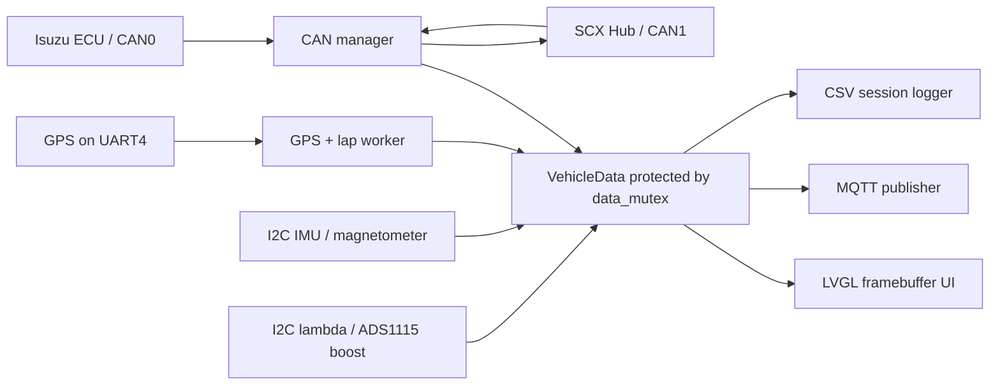

# Isuzu MFD Dashboard

**Purpose:** Primary handover for developers and AI assistants working on the Isuzu dashboard. It covers the current architecture, hardware, configuration, telemetry, racing features, deployment, and constraints.

`isuzu_mfd` is an embedded Linux C99 application for an Isuzu D-Max racing/telemetry installation. It renders an 800 × 480 LVGL dashboard and combines vehicle CAN data, SCX Hub controls, GPS, I2C sensors, MQTT publishing, CSV logging, and GPS-based lap timing.

The application runs as a systemd service. Build from this repository with CMake; deploy the executable to `/mnt/candata/app/isuzu_mfd`.

> Do not commit real MQTT credentials, generated CSV files, or runtime configuration from `/mnt/candata`.

## Project structure

| Path | Responsibility |
| --- | --- |
| `app/main.c` | Starts workers, GPS/lap timing, MQTT/CSV, CAN, camera-service control, and LVGL loop. |
| `app/config_parser.*` | Parses `/mnt/candata/config.txt` for MQTT/device settings and provides polygon helpers. |
| `app/track_config.*` | Loads and validates the active JSON track/event profile. |
| `app/lap_timer.*` | GPS polygon crossing and lap-time state machine. |
| `app/gps_m9n.*` | UART4 NMEA parser for position, UTC time, speed, and satellite data. |
| `app/mqtt_client.*` | MQTT connection and JSON telemetry publisher. |
| `app/csv_logger.*` | Per-application-start CSV file creation and row appending. |
| `app/ads1115_pressure.*` | ADS1115 physical boost/MAP input. |
| `app/lambda_i2c.*` | Lambda-controller I2C input. |
| `app/ism330_imu.*` | ISM330DHCXTR acceleration, gyro, and temperature input. |
| `app/mmc5983ma_mag.*` | MMC5983MA magnetometer input. |
| `can/can_mgr.*` | SocketCAN CAN0 vehicle decoder/OBD polling and CAN1 SCX Hub support. |
| `decode/signals.*` | Shared `VehicleData` and its synchronization mutex. |
| `ui/ui.*` | LVGL pages, display updates, and queued SCX navigation. |
| `config/track.example.json` | Sanitized example runtime track-profile schema. |
| `MQTT_TELEMETRY.md` | MQTT payload contract and field definitions. |
| `PROJECT_DOCUMENTATION.md` | Extended operational and architecture reference. |

## Architecture



`VehicleData` is shared application state. CAN, sensor, and GPS workers update their owned fields while holding `data_mutex`; UI and MQTT take protected local copies. Do not overwrite the whole structure from one worker, or data owned by other workers will be lost.

## Runtime workers

| Worker | Typical rate | Responsibility |
| --- | --- | --- |
| `can_rx` | Event driven | Receives and decodes CAN0 vehicle frames. |
| `can_tx` | 50 ms/request | Sends OBD PID requests on CAN0. |
| `scx_can` | 5 ms loop | Reads SCX buttons and reports RPM to SCX. |
| `gps_m9n` | 15 Hz application polling | Parses GPS and runs lap timing. Fresh values remain limited by GPS NMEA output rate. |
| `ism330_imu` | 50 Hz | Acceleration, gyro, IMU temperature. |
| `mmc5983ma` | 50 Hz | Magnetometer. |
| `ads1115` | 20 Hz | Physical boost pressure. |
| `lambda` | 10 Hz | Lambda ratio. |
| `mqtt_pub` | 25 Hz maximum | MQTT JSON publishing and matching CSV writes. |
| Main/UI | About 60 FPS | LVGL timing, display updates, camera control, SCX navigation. |

## Hardware interfaces

| Interface | Configuration | Purpose |
| --- | --- | --- |
| CAN0 | 500 kbit/s | Isuzu ECU telemetry and OBD polling. |
| CAN1 | 500 kbit/s, 62.5% sample point | SCX Hub keypad input and RPM output. |
| UART4 | `/dev/ttyS4`, 38400 baud | u-blox M9N/N9M GPS NMEA receiver. |
| I2C | ADS1115 | Boost/MAP physical pressure input. |
| I2C | Lambda controller | Lambda ratio. |
| I2C | ISM330DHCXTR | Acceleration, gyro, temperature. |
| I2C | MMC5983MA | Magnetometer. |
| Framebuffer | LVGL + `fbdev` | 800 × 480 display. |

CAN requires correct CAN-H/CAN-L wiring, common ground, SCX power, and termination. Interface `UP` does not prove electrical health; `ERROR-PASSIVE` indicates unreliable bus communication.

## Dashboard and SCX controls

### Page 1 — engine
- RPM, lambda, boost, vehicle speed, fuel rail pressure, and coolant temperature.

### Page 2 — temperatures and GPS
- Coolant, intake-air, and oil temperatures.
- Fuel rail pressure and injection duty.
- GPS valid satellite display and sky plot.

### Page 3 — racing and GPS
- GPS speed and session top speed.
- Boost and session maximum boost.
- GPS display time, currently UTC+7.
- Lateral/longitudinal G-force and maximum absolute G-force for the application session.
- Current lap time, best completed lap, and completed-lap delta.
- Delta is green when faster, red when slower, and unavailable for the first lap.

### SCX button mapping

The SCX Hub emits CAN `0x121` function state; newly pressed functions are queued to the UI thread.

| Function | Action |
| --- | --- |
| F1 | Previous page / up |
| F2 | Previous page / left |
| F3 | Next page / down |
| F4 | Next page / right |
| F5 | Next page / enter |

A physical SCX button may be programmed to a different function than its printed label. Validate the `0x121` bitmap when mapping hardware.

## CAN protocols

### CAN0 vehicle data

`can/can_mgr.c` selects `VEHICLE_ISUZU`. Important IDs:
- `0x160`: engine RPM
- `0x151`: injection duty
- `0x162`: four wheel speeds and average
- `0x150`: accelerator pedal position
- `0x166`: brake position
- `0x7E8`: OBD replies for coolant, oil temperature, MAP, speed, rail pressure, MAF, fuel rate, intake temperature, and battery voltage

OBD requests are standard diagnostic broadcasts on `0x7DF`. The ADS1115 boost sensor is the preferred writer for `v_data.boost`; CAN deliberately does not overwrite it.

### CAN1 SCX Hub

| Direction | CAN ID | Format |
| --- | --- | --- |
| SCX Hub → dashboard | `0x121` | Eight-byte function-state bitmap; F1–F30 occupy bits 0–29 in bytes 1–4. |
| Dashboard → SCX Hub | `0x212` | Eight-byte RPM report; RPM is big-endian in bytes 6–7. |

The dashboard sends `0x212` about every 40 ms.

## Runtime configuration

### MQTT and device configuration

The application reads `/mnt/candata/config.txt` using exact `#KEY:VALUE` syntax with no spaces around `:`.

```text
#SERVER:broker.example.com
#PORT:1883
#MQTT_USER:dashboard_device
#MQTT_PASSWORD:replace-with-a-secret
#APN:internet
#CAR-NUMBER:OMR-01
#DEVICE:6
#EVENT:pt
#CLASS:isuzu
```

| Key | Use |
| --- | --- |
| `SERVER` | Required MQTT host/IP. |
| `PORT` | `1883` if omitted. |
| `MQTT_USER`, `MQTT_PASSWORD` | MQTT credentials; keep real values out of Git. |
| `APN` | Cellular APN deployment metadata. |
| `CAR-NUMBER` | Vehicle identifier in MQTT/CSV data. |
| `DEVICE` | Numeric ID; controls MQTT client ID, topic suffix, and camera service. |
| `EVENT`, `CLASS` | Retained deployment metadata. |

MQTT currently publishes fixed literals `"even":"pt"` and `"class":"isuzu-omr"`. The `even` spelling is intentional for backend compatibility.

### Track and lap configuration

Lap timing loads `/mnt/candata/config/track.json` once at GPS-worker startup. Start with [config/track.example.json](config/track.example.json), copy it to the runtime location, and replace placeholder coordinates. Do not commit a live event profile.

The root requires `schema_version`, `active_event_id`, and an `events` array. The selected event must be `enabled: true`. Each polygon must contain exactly four `{ "lat": ..., "lon": ... }` points ordered around its boundary.

| `lap_mode` | Required polygons | Behavior |
| --- | --- | --- |
| `separate` | `start_polygon`, `finish_polygon` | Enter start to begin a lap; enter finish to complete it. |
| `shared` | `start_finish_polygon` | First entry begins timing; each later valid entry completes a lap and immediately begins the next. |

`min_lap_seconds` defaults to `10`. `min_speed_kmh` rejects low-speed/parked GPS drift; use `0` only for deliberate testing. Restart `isuzu_mfd.service` after a `track.json` change because the profile is not reloaded dynamically.

## GPS and lap timing

Lap timing requires GPS `fix_valid`, valid GPS speed, and speed at or above `min_speed_kmh`. The initial valid position only establishes whether the vehicle is already inside a polygon, preventing a false crossing.

- A lap completion is accepted only after `min_lap_seconds` has elapsed.
- Lap elapsed time uses `CLOCK_MONOTONIC`, so it is independent of GPS time or timezone changes.
- The first completed lap becomes the session best.
- Each later completed lap receives a delta against the best that existed **before** it completed; a faster lap is negative and green, a slower lap positive and red.
- This is a completed-lap comparison, not a live GPS position-matched reference-lap delta.
- GPS/lap logic runs at 15 Hz. Make polygons about 10–20 m wide enough for GPS accuracy and vehicle speed.

## MQTT telemetry

| Setting | Value |
| --- | --- |
| Broker URL | `tcp://<SERVER>:<PORT>` |
| Client ID | `isuzu_device_<DEVICE>` |
| Topic | `/isuzu/omr/<DEVICE>` |
| QoS | `0` |
| Retained | `false` |
| Maximum rate | 25 Hz / 40 ms |
| `datetime` | UTC, `DD/MM/YY HH:MM:SS` |

The current source is in **testing mode**: it publishes whenever MQTT is connected, including RPM `0`. Restore an RPM condition in `mqtt_thread()` only when production engine-only telemetry is desired.

Full payload field types, units, and backend guidance are in `MQTT_TELEMETRY.md`. GPS speed, top speed, lap metrics, SCX state, and maximum boost are not currently part of the MQTT JSON contract.

## CSV logging

At every application start, `csv_logger` creates `/mnt/candata/data/YYMMDD_HH:MM:SS.csv`. Filenames use device local time (currently UTC+7); CSV `datetime` rows are UTC to match MQTT. A row is appended and flushed only after a successful MQTT publish.

## Camera stream service

The main loop derives `gst-stream@car<DEVICE>.service` from `config.txt`. It stops the service at dashboard startup, starts it when CAN is connected and RPM is above zero, and stops it after approximately five seconds at RPM zero or disconnected CAN. This RPM condition remains enabled independently of MQTT testing mode.

## Build and deploy

```text
cmake -S . -B build
cmake --build build -j"$(nproc)"
sudo install -m 0755 build/isuzu_mfd /mnt/candata/app/isuzu_mfd
sudo systemctl restart isuzu_mfd.service
sudo systemctl is-active isuzu_mfd.service
```

The build requires JSON-C headers and library (`libjson-c-dev` on Debian/Ubuntu) for JSON track profiles. The deployed service executes `/mnt/candata/app/isuzu_mfd`.

## Diagnostics

| Path / command | Purpose |
| --- | --- |
| `scripts/test_scx_can1.py` | Standalone SCX CAN1 test/sweep. |
| `scripts/CANBUS.sh` | MCP2515/CAN setup helper. |
| `scripts/test_sensors.sh` | Sensor diagnostic helper. |
| `scripts/test_mqtt_payload.sh` | MQTT payload test helper. |
| `scripts/read_mqtt_payload.sh` | MQTT payload read helper. |
| `ip -details -statistics link show can0` | CAN0 state/errors/counters. |
| `ip -details -statistics link show can1` | CAN1 SCX state/errors/counters. |
| `sudo journalctl -u isuzu_mfd.service -n 100 --no-pager` | Service log. |

Recommended sequence: confirm the service is active, confirm CAN interfaces are healthy, confirm SCX `0x121` messages, obtain a valid GPS fix, then test polygon crossings. Confirm MQTT connects before expecting new CSV rows.

## Implementation rules

1. Hold `data_mutex` when reading or writing `VehicleData`.
2. Do not call LVGL directly from CAN/sensor workers; use `ui_request_navigation()` for SCX navigation.
3. Do not overwrite sensor-owned fields with full `VehicleData` assignments from CAN code.
4. Preserve CAN IDs, bitrates, and SCX byte layout unless intentionally changing the protocol.
5. Keep MQTT fields stable; do not rename `even` to `event` without a coordinated backend migration.
6. Do not add credentials, build output, CSV logs, `/mnt/candata/config.txt`, or `/mnt/candata/config/track.json` to Git.
7. Build after source changes and deploy/restart only after a successful build.

## Known limitations

- MQTT QoS 0 has no delivery guarantee.
- MQTT has no `gps_valid` boolean; backend must validate `sat` and coordinates.
- CSV rows depend on successful MQTT publishes by design.
- GPS/lap logic cannot work until GPS obtains a valid fix.
- Track profiles are loaded only at service start.
- CAN can be electrically unhealthy despite showing `UP`; investigate power, wiring, termination, and bus state.

## Additional references

- `PROJECT_DOCUMENTATION.md`: extended architecture and operations.
- `MQTT_TELEMETRY.md`: source-of-truth MQTT/backend contract.
- Read the source files listed above before modifying a subsystem.