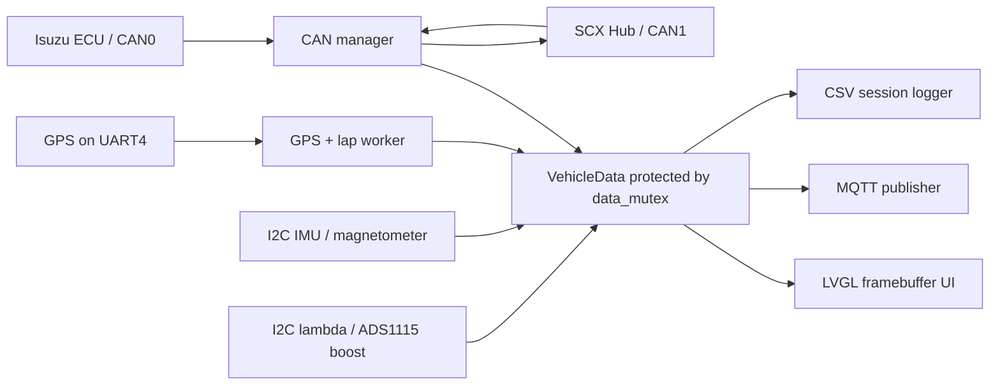

# Isuzu MFD Dashboard

> **Purpose:** This README is the primary handover document for developers and AI assistants working on the Isuzu dashboard. Read it before changing the code. It documents the current architecture, hardware, configuration, telemetry, deployment, and known constraints.

## 1. Project overview

`isuzu_mfd` is an embedded Linux C99 application for an Isuzu D-Max racing/telemetry installation. It renders an 800 × 480 LVGL dashboard and combines vehicle CAN data, SCX Hub controls, GPS, I2C sensors, MQTT publishing, CSV data logging, and GPS-based lap timing.

The application runs as a systemd service on the dashboard computer. The source repository is built with CMake; the deployed executable is copied to `/mnt/candata/app/isuzu_mfd`.

> **Do not commit real MQTT credentials or runtime data.** The runtime configuration is outside the repository at `/mnt/candata/config.txt`.

## 2. Project structure

| Path | Responsibility |
| --- | --- |
| `app/main.c` | Starts worker threads, GPS/lap timer, MQTT/CSV worker, CAN workers, and LVGL main loop. |
| `app/config_parser.*` | Parses `/mnt/candata/config.txt`, including MQTT and lap polygons. |
| `app/mqtt_client.*` | MQTT connection and JSON telemetry publisher. |
| `app/csv_logger.*` | Per-application-start CSV file creation and row appending. |
| `app/lap_timer.*` | GPS polygon crossing and lap-time state machine. |
| `app/gps_m9n.*` | UART4 NMEA parser for GPS position, UTC time, speed, and satellite data. |
| `app/ads1115_pressure.*` | ADS1115 physical boost/MAP pressure input. |
| `app/lambda_i2c.*` | Lambda controller I2C input. |
| `app/ism330_imu.*` | ISM330DHCXTR acceleration, gyro, and temperature input. |
| `app/mmc5983ma_mag.*` | MMC5983MA magnetometer input. |
| `can/can_mgr.*` | SocketCAN CAN0 vehicle decoder/OBD polling and CAN1 SCX Hub support. |
| `decode/signals.*` | `VehicleData` shared telemetry state and synchronization mutex. |
| `ui/ui.*` | LVGL page creation, display updates, and queued SCX navigation. |
| `ui/styles.*` | LVGL styles. |
| `scripts/` | CAN, SCX, MQTT, and sensor diagnostic tools. |
| `MQTT_TELEMETRY.md` | Full backend MQTT payload contract and field definitions. |
| `PROJECT_DOCUMENTATION.md` | Extended operational and architecture reference. |
| `isuzu_mfd.service` | Reference systemd service unit. |
| `lvgl/`, `lv_drivers/` | Vendored LVGL and display/input drivers. |

## 3. System architecture



`VehicleData` is shared application state. Sensor, GPS, and CAN workers update it while holding `data_mutex`. The UI and MQTT workers take protected local copies. Do not overwrite the full structure from one worker, or sensor data from other workers will be lost.

## 4. Runtime workers

| Worker | Typical rate | Responsibility |
| --- | --- | --- |
| `can_rx` | Event driven | Receives and decodes CAN0 vehicle frames. |
| `can_tx` | 50 ms per request | Sends OBD PID requests on CAN0. |
| `scx_can` | 5 ms loop | Reads SCX buttons on CAN1 and reports RPM to SCX. |
| `gps_m9n` | 5 Hz | Parses GPS and runs the lap timer. |
| `ism330_imu` | 50 Hz | Acceleration, gyro, IMU temperature. |
| `mmc5983ma` | 50 Hz | Magnetometer. |
| `ads1115` | 20 Hz | Physical boost pressure. |
| `lambda` | 10 Hz | Lambda ratio. |
| `mqtt_pub` | 25 Hz maximum | MQTT JSON publishing and matching CSV writes. |
| Main/UI | about 60 FPS | LVGL timing, data display, SCX navigation requests. |

## 5. Hardware interfaces

| Interface | Configuration | Purpose |
| --- | --- | --- |
| CAN0 | 500 kbit/s | Isuzu ECU telemetry and OBD polling. |
| CAN1 | 500 kbit/s, 62.5% sample point | SCX Hub keypad input and RPM output. |
| UART4 | `/dev/ttyS4`, 38400 baud | u-blox M9N/N9M GPS NMEA receiver. |
| I2C | ADS1115 | Boost/MAP physical pressure input. |
| I2C | Lambda controller | Lambda ratio. |
| I2C | ISM330DHCXTR | Acceleration, gyro, temperature. |
| I2C | MMC5983MA | Magnetometer. |
| Framebuffer | LVGL + `fbdev` | 800 × 480 display. |

CAN must have a working physical bus: correct CAN-H/CAN-L wiring, common ground, SCX power, and proper termination. Linux `UP` state alone is insufficient. `ERROR-PASSIVE` indicates unreliable communication; repower the SCX Hub if it becomes unresponsive.

## 6. Dashboard pages and SCX controls

### Page 1 — engine
- Engine RPM
- Lambda
- Boost in kPa
- Vehicle speed
- Fuel rail pressure in MPa
- Coolant temperature in °C

### Page 2 — temperatures and GPS
- Coolant, intake-air, and oil temperatures
- Fuel rail pressure and injection duty
- GPS valid satellite display and sky plot

### Page 3 — racing and GPS
- GPS speed and session top speed
- Boost and session maximum boost
- GPS display time (currently shown as UTC+7 on screen)
- Lateral and longitudinal G-force
- GPS polygon **LAP TIME** in `minutes:seconds.centiseconds` format

### SCX button mapping
The SCX Hub emits CAN `0x121` function state. New presses are queued to the UI thread.

| Function | Dashboard action |
| --- | --- |
| F1 | Previous page / up |
| F2 | Previous page / left |
| F3 | Next page / down |
| F4 | Next page / right |
| F5 | Next page / enter |

The actual SCX button labels must be validated by observing the `0x121` bitmap; a physical button can be programmed to send a function different from its label.

## 7. CAN protocols

### CAN0 vehicle data
`can/can_mgr.c` selects `VEHICLE_ISUZU`. Important decoded inputs include:
- `0x160`: engine RPM
- `0x151`: injection duty
- `0x162`: four wheel speeds and average speed
- `0x150`: accelerator pedal position
- `0x166`: brake position
- `0x7E8`: OBD responses for coolant, oil temperature, MAP, vehicle speed, rail pressure, MAF, fuel rate, intake temperature, and battery voltage

OBD requests are sent as standard diagnostic broadcasts on `0x7DF`.

> The physical ADS1115 sensor is the preferred writer for `v_data.boost`; the CAN decoder intentionally does not overwrite it.

### CAN1 SCX Hub
| Direction | CAN ID | Format |
| --- | --- | --- |
| SCX Hub → dashboard | `0x121` | Eight-byte function-state bitmap; functions F1–F30 occupy bits 0–29 in bytes 1–4. |
| Dashboard → SCX Hub | `0x212` | Eight-byte RPM report; RPM is big-endian in bytes 6–7. |

The dashboard sends `0x212` about every 40 ms. CAN1 is configured at 500 kbit/s with a 62.5% sample point.

## 8. Runtime configuration

The application reads this file at runtime:
```text
/mnt/candata/config.txt
```

Use the exact `#KEY:VALUE` syntax with no spaces around `:`.

```text
#SERVER:broker.example.com
#PORT:1883
#MQTT_USER:dashboard_device
#MQTT_PASSWORD:replace-with-a-secret
#APN:internet
#CAR-NUMBER:OMR-01
#DEVICE:6
#EVENT:pt
#CLASS:isuzu
#START:13.765500,100.581500;13.765360,100.581555;13.765300,100.581350;13.765440,100.581295
#FINISH:13.765956,100.582751;13.765715,100.582835;13.765655,100.582600;13.765855,100.582483
#LAP_MIN_SECONDS:10
```

| Key | Default / use |
| --- | --- |
| `SERVER` | Required MQTT host/IP. |
| `PORT` | `1883` if omitted. |
| `MQTT_USER`, `MQTT_PASSWORD` | MQTT credentials. Keep real values out of Git. |
| `APN` | Cellular APN deployment metadata. |
| `CAR-NUMBER` | Vehicle identifier inserted into MQTT/CSV data. |
| `DEVICE` | Numeric device ID; default `1`; controls client ID and topic suffix. |
| `START` | Four `latitude,longitude` corners separated by semicolons. |
| `FINISH` | Four `latitude,longitude` corners separated by semicolons. |
| `LAP_MIN_SECONDS` | Minimum elapsed lap time before accepting a finish; default `10`. |

`EVENT` and `CLASS` are retained configuration metadata. MQTT currently publishes fixed literals `"even":"pt"` and `"class":"isuzu-omr"`. The `even` spelling is intentional for compatibility with the current backend contract.

## 9. GPS and lap timing

GPS must have `fix_valid` before lap timing operates.

1. Initial valid GPS position records whether the car starts inside either zone, without triggering a crossing.
2. Enter the `START` polygon to start timing.
3. Enter the `FINISH` polygon to finish the lap if the elapsed time is at least `LAP_MIN_SECONDS`.
4. The last completed lap remains displayed until another valid start crossing.

Lap elapsed time uses `CLOCK_MONOTONIC`, so it is unaffected by GPS clock synchronization or timezone changes. GPS samples are processed at 5 Hz; make zones approximately 10–20 meters wide enough for GPS accuracy and vehicle speed. Order the four polygon corners consecutively around the boundary.

## 10. MQTT telemetry

| Setting | Value |
| --- | --- |
| Broker URL | `tcp://<SERVER>:<PORT>` |
| Client ID | `isuzu_device_<DEVICE>` |
| Topic | `/isuzu/omr/<DEVICE>` |
| QoS | `0` (at most once) |
| Retained | `false` |
| Maximum publish rate | 25 Hz, one update every 40 ms |
| `datetime` | Always UTC, format `DD/MM/YY HH:MM:SS` |

The current source is in **testing mode**: it publishes whenever the MQTT connection is active, even if RPM is zero. Before production engine-only reporting, restore the `local_data.rpm > 0` condition in `mqtt_thread()` in `app/main.c`.

> QoS 0 can lose or delay messages. Backend systems must not rely on every record arriving.

The MQTT payload is one JSON object. Full field types, units, example payload, and backend guidance are in `MQTT_TELEMETRY.md`. Current field names are:
```text
device, car, datetime, lat, lon, speed, x, y, z,
mag_x, mag_y, mag_z, gy_x, gy_y, gy_z, map, lambda,
even, class, hr, duty_injection, battery_voltage, throttle,
coolant_temp, fuel_flow_rate, fuel_rail_pressure, oil_pressure,
oil_temp, rpm, sat, air_temp, speed_fl, speed_fr, speed_rl, speed_rr, drs
```

Notes for backend developers:
- `speed` is average wheel speed, not GPS speed.
- `lat` and `lon` may be `0.0` until GPS has a valid position.
- `sat` is the GPS satellite-used count; use it plus coordinate validation to assess location validity.
- `datetime` is UTC but not ISO 8601. Store backend ingestion time too.
- `hr`, `drs`, and normally `oil_pressure` are reserved/unsupported.
- GPS speed, top speed, lap time, SCX state, and max boost are currently not included in MQTT JSON.

## 11. CSV logging

At every application start, `csv_logger` creates one file:
```text
/mnt/candata/data/YYMMDD_HH:MM:SS.csv
```

Filename timestamps use the device local timezone (currently UTC+7). CSV row `datetime` values use UTC, matching MQTT.

A header is written first. One CSV row is appended only after a successful MQTT publish, then flushed. This means MQTT connection failure prevents both MQTT sends and new CSV telemetry rows.

## 12. Build and deploy

### Build
```text
cmake -S . -B build
cmake --build build -j"$(nproc)"
```

Output executable:
```text
build/isuzu_mfd
```

### Deploy
```text
sudo install -m 0755 build/isuzu_mfd /mnt/candata/app/isuzu_mfd
sudo systemctl restart isuzu_mfd.service
sudo systemctl is-active isuzu_mfd.service
```

The deployed service should execute `/mnt/candata/app/isuzu_mfd`. Check it with:
```text
sudo systemctl status isuzu_mfd.service
```

## 13. Diagnostics and test tools

| Path / command | Purpose |
| --- | --- |
| `scripts/test_scx_can1.py` | Standalone SCX CAN1 test/sweep tool. |
| `scripts/CANBUS.sh` | MCP2515/CAN setup helper. |
| `scripts/test_sensors.sh` | Sensor diagnostic helper. |
| `scripts/test_mqtt_payload.sh` | MQTT payload test helper. |
| `scripts/read_mqtt_payload.sh` | MQTT payload read helper. |
| `/tmp/mqtt_debug.log` | MQTT load/connect diagnostics. |
| `/tmp/imu_debug.log` | IMU startup samples. |
| `/tmp/mag_debug.log` | Magnetometer startup samples. |
| `ip -details -statistics link show can0` | CAN0 state/errors/counters. |
| `ip -details -statistics link show can1` | CAN1 SCX state/errors/counters. |
| `sudo journalctl -u isuzu_mfd.service -n 100 --no-pager` | Service startup/runtime log. |

Recommended test sequence:
1. Confirm the service is active.
2. Confirm CAN0 and CAN1 are `UP` and preferably `ERROR-ACTIVE`.
3. Confirm SCX button messages arrive on `0x121` before debugging UI logic.
4. Confirm GPS has a valid position fix before testing polygon crossings.
5. Confirm a new CSV file appears after each service restart.
6. Confirm MQTT connects in `/tmp/mqtt_debug.log`; only then will CSV data rows appear.

## 14. Important implementation rules for future changes

1. Preserve `data_mutex` when reading or writing `VehicleData`.
2. Do not call LVGL UI functions directly from CAN or sensor workers. Use `ui_request_navigation()` for SCX navigation; the UI loop processes it safely.
3. Do not overwrite sensor-owned fields with a full `VehicleData` assignment from CAN code.
4. Preserve standard CAN IDs, bitrate, and SCX byte layout unless the SCX protocol is deliberately changed.
5. Keep MQTT field names stable for backend compatibility. In particular, do not rename `even` to `event` without a coordinated migration.
6. Do not add production broker passwords, generated `__pycache__`, build products, CSV logs, or `/mnt/candata/config.txt` to Git.
7. Build the project after C source changes and restart the service only after deploying the new binary.

## 15. Known limitations

- MQTT QoS is 0 and has no delivery guarantee.
- No MQTT `gps_valid` boolean exists; backend must validate `sat` and coordinates.
- CSV depends on successful MQTT publishing by current design.
- GPS position/lap logic cannot work until the GPS receiver has a valid fix.
- GPS time in MQTT/CSV is UTC; Page 3 display time is UTC+7.
- CAN hardware can be electrically unhealthy despite an interface being `UP`. `ERROR-PASSIVE` requires bus/power/wiring/termination investigation.

## 16. Additional references

- `PROJECT_DOCUMENTATION.md` contains an extended architecture and operations reference.
- `MQTT_TELEMETRY.md` is the source-of-truth MQTT/backend contract.
- Read the source files named in the project structure table before altering a subsystem.